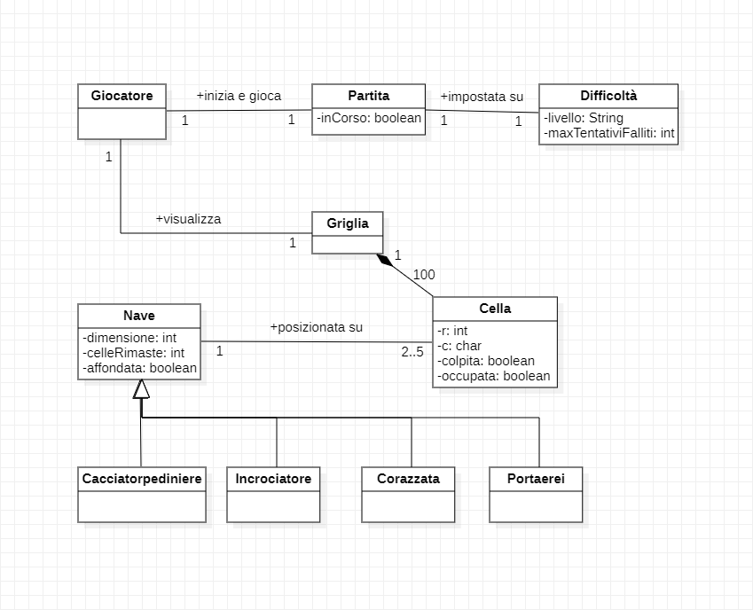
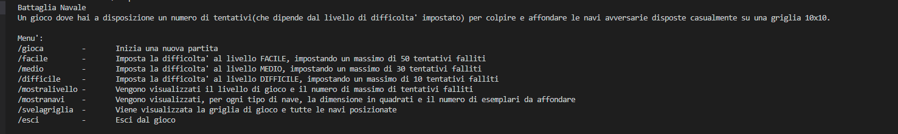
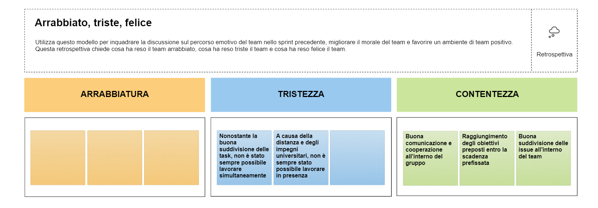

# Relazione tecnica

### Sezioni

1. Introduzione
2. Modello di dominio
3. Requisiti specifici
  - Requisiti funzionali
  - Requisiti non funzionali
7. Manuale utente
9. Analisi retrospettiva
  - Sprint 0

## Introduzione

La presente relazione tecnica descrive il processo di sviluppo di una versione digitale del gioco della Battaglia Navale, implementata utilizzando il linguaggio di programmazione Java. L'obiettivo di questo progetto è stato quello di applicare le conoscenze acquisite nello studio di Java e delle sue librerie per creare un'esperienza interattiva e coinvolgente per i giocatori.

Scopo del gioco:

Il gioco della Battaglia Navale è una sfida strategica in cui due giocatori si sfidano per cercare e affondare le navi nemiche sulla griglia di gioco. Lo scopo principale di questa implementazione digitale è fornire un'esperienza realistica e divertente.

Architettura del gioco:

La Battaglia Navale è stata sviluppata seguendo un'architettura orientata agli oggetti. Sono state utilizzate diverse classi per rappresentare gli elementi chiave del gioco, come le navi, la griglia di gioco e i giocatori. L'uso di concetti come l'ereditarietà e l'interfaccia ha permesso una progettazione modulare, semplificando l'implementazione di nuove funzionalità e la gestione dei vari aspetti del gioco.

Componenti principali:

Il gioco della Battaglia Navale include diversi componenti fondamentali, tra cui:

- Griglia di gioco: Una rappresentazione 2D della mappa di gioco, che mostra la posizione delle navi e gli attacchi effettuati dal giocatore.

- Navi: Le navi sono posizionate sulla griglia di gioco e hanno dimensioni e orientamenti diversi. Ogni nave occupa un certo numero di caselle e deve essere interamente colpita per essere affondata e eliminata.

- Giocatori: Il gioco coinvolge un giocatore, il quale cercherà di affondare tutte le navi nemiche posizionate casualmente dalla CPU.

- Interfaccia comandi: L'interfaccia comandi consente al giocatore di interagire con il gioco, visualizzare la griglia di gioco, la posizione delle navi, uscire dal gioco etc.

## Modello di dominio

**Modello concettuale:**

## Requisiti specifici

### Requisiti funzionali

**Obiettivo:** predisporre una nuova partita

**Come giocatore voglio mostrare l'help con elenco comandi**

**Criteri di accettazione**

Al comando /help o invocando l'app con flag --help o -h

il risultato è una descrizione concisa, che normalmente appare all'avvio del programma, seguita dalla lista di comandi disponibili, uno per riga, come da esempio successivo:

- gioca
- esci
- ...

**Come giocatore voglio chiudere il gioco**

**Criteri di accettazione**

Al comando /esci

l'applicazione chiede conferma

- se la conferma è positiva, l'applicazione si chiude restituendo il controllo al sistema operativo.
- se la conferma è negativa, l'applicazione si predispone a ricevere nuovi tentativi o comandi.

**Come giocatore voglio impostare il livello di gioco per variare il numero massimo di tentativi sbagliati**

**Criteri di accettazione**

Al comando /facile 

l’applicazione risponde con OK e imposta a 50 il numero massimo di tentativi falliti.

Al comando /medio

l’applicazione risponde con OK e imposta a 30 il numero massimo di tentativi falliti.

Al comando /difficile

l’applicazione risponde con OK e imposta a 10 il numero massimo di tentativi falliti.

**Come giocatore voglio mostrare il livello di gioco e il numero di massimo di tentativi falliti**

**Criteri di accettazione**

Al comando /mostralivello

l’applicazione risponde visualizzando il livello di gioco e il numero massimo di tentativi falliti.

**Come giocatore voglio mostrare i tipi di nave e il numero**

**Criteri di accettazione**

Al comando /mostranavi

l’applicazione risponde visualizzando, per ogni tipo di nave, la dimensione in quadrati e il numero di esemplari da affondare:

-  	Cacciatorpediniere 	⊠⊠         esemplari: 4
-	Incrociatore 		⊠⊠⊠       esemplari: 3
-	Corazzata 		    ⊠⊠⊠⊠ 	 esemplari: 2
-	Portaerei  		    ⊠⊠⊠⊠⊠ 	esemplari: 1

**Come giocatore voglio iniziare una nuova partita**

**Criteri di accettazione**

Al comando /gioca

se nessuna partita è in corso l'applicazione imposta causalmente le navi, in orizzontale o in verticale, mostra la griglia vuota e si predispone a ricevere il primo tentativo o altri comandi.

**Come giocatore voglio svelare la griglia con le navi posizionate**

**Criteri di accettazione**

Al comando /svelagriglia

l’applicazione risponde visualizzando, una griglia 10x10, con le righe numerate da 1 a 10 e le colonne numerate da A a J, e tutte le navi posizionate.

### Requisiti non funzionali

RNF1: il container docker dell’app deve essere eseguito da terminali che supportano Unicode con encoding UTF-8 o UTF-16.
**Elenco di terminali supportati**

Linux:

- Terminal

Windows:

- Powershell
- Git Bash

## Manuale utente

**Comando per l’esecuzione del container**

Dopo aver eseguito il comando docker pull copiandolo da GitHub Packages, Il comando Docker da usare per eseguire il container contenente l’applicazione è:

docker run --rm -it ghcr.io/softeng2223-inf-uniba/battleship-goldwasser:latest

## Analisi retrospettiva

### Sprint 0

